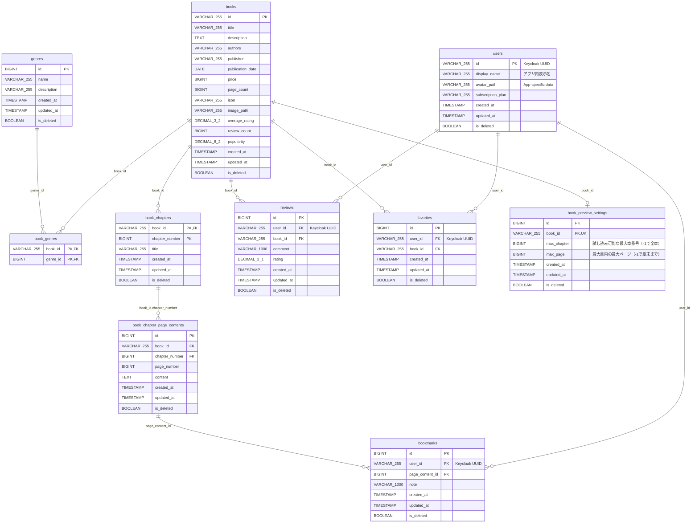

# My Books Backend - データベース設計ガイド（新人研修向け）

## 目次
1. [概要とER図](#概要とer図)
2. [学習の進め方](#学習の進め方)
3. [ユーザーテーブル（Keycloak連携）](#ユーザーテーブルkeycloak連携)
4. [コンテンツ管理テーブル群](#コンテンツ管理テーブル群)
5. [ユーザー操作テーブル群](#ユーザー操作テーブル群)
6. [階層構造テーブル群](#階層構造テーブル群)
7. [試し読み設定テーブル](#試し読み設定テーブル)
8. [パフォーマンス最適化](#パフォーマンス最適化)
9. [Spring Boot開発への接続](#spring-boot開発への接続)

---

## 概要とER図

### システム概要
My Books Backendは、オンライン書籍管理システムのREST APIバックエンドです。Keycloak（OAuth2/OIDC）による認証統合、BFF経由アーキテクチャ、フリーミアム戦略に対応した設計となっています。

書籍管理、レビュー機能、お気に入り、ブックマーク機能、試し読み機能を提供します。

**認証の責務分離**:
- **Keycloak側**: ユーザー認証（email, password）、ロール・権限管理
- **アプリDB側**: アプリケーション固有データ（表示名、アバター、サブスクリプションプラン）

### ER図


---

## 学習の進め方

このデータベース設計は、Spring Boot開発を段階的に学習できるよう、以下の順序で理解することを推奨します：

### 学習ステップ
1. **ユーザーテーブル** - Keycloak連携、外部IdP統合の基本
2. **コンテンツ管理テーブル群** - 書籍とジャンル（多対多関係）
3. **ユーザー操作テーブル群** - レビュー、お気に入り（ユーザーアクション）
4. **階層構造テーブル群** - 書籍の章とページ（複合主キー）
5. **試し読み設定テーブル** - フリーミアム戦略の実装
6. **パフォーマンス最適化** - インデックス戦略

### 各ステップで学ぶこと
- **データベース設計原則** - 正規化、外部キー制約
- **JPA/Hibernateマッピング** - Entity、Repository設計
- **外部IdP連携** - Keycloak + OAuth2 Resource Server
- **API設計** - REST エンドポイントの設計

---

## ユーザーテーブル（Keycloak連携）

### 1. users テーブル
アプリケーション固有のユーザーデータを管理するテーブル

```sql
CREATE TABLE `users` (
  `id` VARCHAR(255) NOT NULL PRIMARY KEY,  -- Keycloak UUID
  -- email, username, familyName, givenName, roles: Keycloakで管理（JWTクレームから取得）
  `display_name` VARCHAR(255) NOT NULL DEFAULT 'ユーザー',  -- アプリ内表示名
  `avatar_path` VARCHAR(255) DEFAULT NULL,  -- アプリケーション固有データ
  `subscription_plan` VARCHAR(255) NOT NULL DEFAULT 'FREE',  -- アプリケーション固有データ
  `created_at` TIMESTAMP DEFAULT CURRENT_TIMESTAMP,
  `updated_at` TIMESTAMP DEFAULT CURRENT_TIMESTAMP ON UPDATE CURRENT_TIMESTAMP,
  `is_deleted` BOOLEAN NOT NULL DEFAULT FALSE
);
```

#### 設計のポイント
- **主キー**: `id` (VARCHAR(255)) - Keycloakが発行するUUIDをそのまま使用
- **責務分離**: 認証情報（email, password, roles）はKeycloak側で管理し、DBにはアプリ固有データのみ格納
- **サブスクリプション**: `subscription_plan` でフリーミアム戦略を管理（`FREE` / `PREMIUM`）
- **論理削除**: `is_deleted` フラグで削除管理
- **タイムスタンプ**: 作成・更新時刻を自動管理

#### ロール管理について
**重要**: ロール管理はすべてKeycloak側で行い、アプリDBには `roles` / `user_roles` テーブルは存在しません。

- JWTの `realm_access.roles` クレームからロールを取得
- `JwtClaimExtractor` ユーティリティでクレーム抽出
- `RoleConfig` でKeycloakロールをアプリ内権限にマッピング（例: `ROLE_USER` → `book-content:read:all`, `favorite:manage:own` 等）

#### 新人へのポイント
- **外部IdP連携**: 認証情報を自前で管理せず、Keycloak等の外部IdPに委譲する設計パターン
- **初回自動登録**: ユーザーがアプリに初めてアクセスした際、JWTの `sub` クレーム（UUID）をIDとしてDBにレコードを自動作成
- **論理削除とは？**: データを物理的に削除せず、フラグで「削除済み」として扱う方式。データの復旧やトレーサビリティが可能

---

## コンテンツ管理テーブル群

### 1. books テーブル
書籍情報の中核テーブル

```sql
CREATE TABLE `books` (
  `id` VARCHAR(255) NOT NULL PRIMARY KEY,
  `title` VARCHAR(255) NOT NULL DEFAULT '',
  `description` TEXT NOT NULL,
  `authors` VARCHAR(255) NOT NULL DEFAULT '',
  `publisher` VARCHAR(255) NOT NULL DEFAULT '',
  `publication_date` DATE NOT NULL,
  `price` BIGINT NOT NULL DEFAULT 0,
  `page_count` BIGINT NOT NULL DEFAULT 0,
  `isbn` VARCHAR(255) NOT NULL DEFAULT '',
  `image_path` VARCHAR(255) DEFAULT NULL,
  `average_rating` DECIMAL(3, 2) NOT NULL DEFAULT 0.00,
  `review_count` BIGINT NOT NULL DEFAULT 0,
  `popularity` DECIMAL(8, 2) NOT NULL DEFAULT 0.000,
  `created_at` TIMESTAMP DEFAULT CURRENT_TIMESTAMP,
  `updated_at` TIMESTAMP DEFAULT CURRENT_TIMESTAMP ON UPDATE CURRENT_TIMESTAMP,
  `is_deleted` BOOLEAN NOT NULL DEFAULT FALSE
);
```

#### 設計のポイント
- **文字列主キー**: `id` (VARCHAR) - ビジネス要件による
- **統計フィールド**: `average_rating`, `review_count`, `popularity` - 非正規化による高速化
- **金額**: `price` (BIGINT) - 円単位で格納（小数点回避）

#### 新人へのポイント
- **非正規化とは？**: 正規化とは逆に、計算済みの値をテーブルに保存してクエリ性能を向上させる手法
- **文字列主キー**: 通常は数値型を使うが、ビジネス要件によっては文字列型も選択肢
- **DECIMAL型**: 金額や評価などの正確な小数を扱う場合はFLOATでなくDECIMALを使用

### 2. genres テーブル
ジャンル情報を管理

```sql
CREATE TABLE `genres` (
  `id` BIGINT NOT NULL AUTO_INCREMENT PRIMARY KEY,
  `name` VARCHAR(255) NOT NULL,
  `description` VARCHAR(255) NOT NULL DEFAULT '',
  `created_at` TIMESTAMP DEFAULT CURRENT_TIMESTAMP,
  `updated_at` TIMESTAMP DEFAULT CURRENT_TIMESTAMP ON UPDATE CURRENT_TIMESTAMP,
  `is_deleted` BOOLEAN NOT NULL DEFAULT FALSE,
  UNIQUE KEY (`name`)
);
```

### 3. book_genres テーブル（中間テーブル）
書籍とジャンルの多対多関係

```sql
CREATE TABLE `book_genres` (
  `book_id` VARCHAR(255) NOT NULL,
  `genre_id` BIGINT NOT NULL,
  PRIMARY KEY (`book_id`, `genre_id`),
  FOREIGN KEY (`book_id`) REFERENCES `books`(`id`) ON DELETE CASCADE,
  FOREIGN KEY (`genre_id`) REFERENCES `genres`(`id`) ON DELETE CASCADE
);
```

#### 新人へのポイント
- **多対多の実例**: 1冊の本は複数のジャンルに属し、1つのジャンルは複数の本を含む
- **中間テーブルの命名**: `table1_table2` の命名パターンが一般的
- **CASCADE削除**: 親レコードが削除されたとき、関連する子レコードも自動削除

#### 学習ポイント - ジャンル検索のクエリ例
```sql
-- 「ミステリー」ジャンルの書籍を検索
SELECT b.title, b.authors
FROM books b
JOIN book_genres bg ON b.id = bg.book_id
JOIN genres g ON bg.genre_id = g.id
WHERE g.name = 'ミステリー' AND b.is_deleted = false;
```

---

## ユーザー操作テーブル群

### 1. reviews テーブル
書籍レビューを管理

```sql
CREATE TABLE `reviews` (
  `id` BIGINT NOT NULL AUTO_INCREMENT PRIMARY KEY,
  `user_id` VARCHAR(255) NOT NULL,  -- Keycloak UUID
  `book_id` VARCHAR(255) NOT NULL,
  `comment` VARCHAR(1000) NOT NULL DEFAULT '',
  `rating` DECIMAL(2, 1) NOT NULL DEFAULT 0.0 CHECK (`rating` >= 0 AND `rating` <= 5),
  `created_at` TIMESTAMP DEFAULT CURRENT_TIMESTAMP,
  `updated_at` TIMESTAMP DEFAULT CURRENT_TIMESTAMP ON UPDATE CURRENT_TIMESTAMP,
  `is_deleted` BOOLEAN NOT NULL DEFAULT FALSE,
  UNIQUE (`user_id`, `book_id`),
  FOREIGN KEY (`user_id`) REFERENCES `users`(`id`) ON DELETE CASCADE,
  FOREIGN KEY (`book_id`) REFERENCES `books`(`id`) ON DELETE CASCADE
);
```

#### 設計のポイント
- **一意制約**: (user_id, book_id) - 1人1冊1レビューの制約
- **CHECK制約**: rating 0.0-5.0 の範囲制限
- **user_id**: VARCHAR(255) - Keycloakが発行するUUID
- **統計連携**: 書籍の average_rating, review_count を自動更新

#### 新人へのポイント
- **CHECK制約**: データベースレベルでの値の妥当性チェック
- **ビジネスルール**: 1人が同じ本に複数レビューできないようにユニーク制約で制御

### 2. favorites テーブル
お気に入り書籍を管理

```sql
CREATE TABLE `favorites` (
  `id` BIGINT NOT NULL AUTO_INCREMENT PRIMARY KEY,
  `user_id` VARCHAR(255) NOT NULL,  -- Keycloak UUID
  `book_id` VARCHAR(255) NOT NULL,
  `created_at` TIMESTAMP DEFAULT CURRENT_TIMESTAMP,
  `updated_at` TIMESTAMP DEFAULT CURRENT_TIMESTAMP ON UPDATE CURRENT_TIMESTAMP,
  `is_deleted` BOOLEAN NOT NULL DEFAULT FALSE,
  UNIQUE (`user_id`, `book_id`),
  FOREIGN KEY (`user_id`) REFERENCES `users`(`id`) ON DELETE CASCADE,
  FOREIGN KEY (`book_id`) REFERENCES `books`(`id`) ON DELETE CASCADE
);
```

#### 新人へのポイント
- **いいね機能**: SNSでよく見る「いいね」機能のデータベース実装パターン
- **重複防止**: 同じ書籍を複数回お気に入りできない制約

---

## 階層構造テーブル群

### 1. book_chapters テーブル
書籍の章構造を管理

```sql
CREATE TABLE `book_chapters` (
  `book_id` VARCHAR(255) NOT NULL,
  `chapter_number` BIGINT NOT NULL,
  `title` VARCHAR(255) NOT NULL,
  `created_at` TIMESTAMP DEFAULT CURRENT_TIMESTAMP,
  `updated_at` TIMESTAMP DEFAULT CURRENT_TIMESTAMP ON UPDATE CURRENT_TIMESTAMP,
  `is_deleted` BOOLEAN NOT NULL DEFAULT FALSE,
  PRIMARY KEY (`book_id`, `chapter_number`),
  FOREIGN KEY (`book_id`) REFERENCES `books`(`id`) ON DELETE CASCADE
);
```

#### 設計のポイント
- **複合主キー**: (book_id, chapter_number) - 書籍内での章番号一意性
- **順序管理**: chapter_number で章の順序を管理

#### 新人へのポイント
- **複合主キーの用途**: 「書籍A の第1章」のように、複数の要素で一意性を保証したい場合
- **章番号**: 1から始まる連番で章の順序を表現

### 2. book_chapter_page_contents テーブル
書籍ページの実際のコンテンツを管理

```sql
CREATE TABLE `book_chapter_page_contents` (
  `id` BIGINT NOT NULL AUTO_INCREMENT PRIMARY KEY,
  `book_id` VARCHAR(255) NOT NULL,
  `chapter_number` BIGINT NOT NULL,
  `page_number` BIGINT NOT NULL,
  `content` TEXT NOT NULL,
  `created_at` TIMESTAMP DEFAULT CURRENT_TIMESTAMP,
  `updated_at` TIMESTAMP DEFAULT CURRENT_TIMESTAMP ON UPDATE CURRENT_TIMESTAMP,
  `is_deleted` BOOLEAN NOT NULL DEFAULT FALSE,
  UNIQUE (`book_id`, `chapter_number`, `page_number`),
  FOREIGN KEY (`book_id`, `chapter_number`) REFERENCES `book_chapters`(`book_id`, `chapter_number`) ON DELETE CASCADE
);
```

#### 設計のポイント
- **三重一意制約**: (book_id, chapter_number, page_number) - ページの一意性
- **複合外部キー**: book_chapters への参照
- **コンテンツ格納**: TEXT型で実際の書籍内容を格納

#### 新人へのポイント
- **複合外部キー**: 複合主キーを持つテーブルへの外部キー参照
- **TEXT型**: 長いテキストデータを格納する型（VARCHARより大容量）

### 3. bookmarks テーブル
ユーザーのブックマーク機能

```sql
CREATE TABLE `bookmarks` (
  `id` BIGINT NOT NULL AUTO_INCREMENT PRIMARY KEY,
  `user_id` VARCHAR(255) NOT NULL,  -- Keycloak UUID
  `page_content_id` BIGINT NOT NULL,
  `note` VARCHAR(1000) NOT NULL DEFAULT '',
  `created_at` TIMESTAMP DEFAULT CURRENT_TIMESTAMP,
  `updated_at` TIMESTAMP DEFAULT CURRENT_TIMESTAMP ON UPDATE CURRENT_TIMESTAMP,
  `is_deleted` BOOLEAN NOT NULL DEFAULT FALSE,
  UNIQUE (`user_id`, `page_content_id`),
  FOREIGN KEY (`user_id`) REFERENCES `users`(`id`) ON DELETE CASCADE,
  FOREIGN KEY (`page_content_id`) REFERENCES `book_chapter_page_contents`(`id`) ON DELETE CASCADE
);
```

#### 新人へのポイント
- **階層参照**: ページレベルでの精密なブックマーク（書籍→章→ページ）
- **ユーザーメモ**: ブックマークと一緒にメモも保存できる仕様

---

## 試し読み設定テーブル

### book_preview_settings テーブル
書籍ごとの試し読み範囲を管理するテーブル。フリーミアム戦略の中核となる設定です。

```sql
CREATE TABLE `book_preview_settings` (
  `id` BIGINT NOT NULL AUTO_INCREMENT PRIMARY KEY,
  `book_id` VARCHAR(255) NOT NULL,
  `max_chapter` BIGINT NOT NULL DEFAULT 1,    -- 試し読み可能な最大章番号（-1で全章開放）
  `max_page` BIGINT NOT NULL DEFAULT -1,     -- 最大章内の最大ページ番号（-1で章末まで開放）
  `created_at` TIMESTAMP DEFAULT CURRENT_TIMESTAMP,
  `updated_at` TIMESTAMP DEFAULT CURRENT_TIMESTAMP ON UPDATE CURRENT_TIMESTAMP,
  `is_deleted` BOOLEAN NOT NULL DEFAULT FALSE,
  UNIQUE KEY `uk_book_preview` (`book_id`),
  FOREIGN KEY (`book_id`) REFERENCES `books`(`id`) ON DELETE CASCADE
);
```

#### 設計のポイント
- **1対1関係**: 1冊の書籍に対して1つの試し読み設定（UNIQUE制約）
- **柔軟な範囲設定**: `max_chapter` と `max_page` の組み合わせで細かく制御
  - 例: `max_chapter=1, max_page=-1` → 第1章全体を開放
  - 例: `max_chapter=2, max_page=3` → 第2章3ページまで開放
  - 例: `max_chapter=-1` → 全章開放
- **デフォルト値**: 未設定の場合は第1章全体が試し読み対象

#### フリーミアム戦略との連携
- **パブリックAPI**: `GET /book-content/preview/**` - 試し読み範囲内のコンテンツは誰でもアクセス可能
- **有料API**: `GET /book-content/**` - 全コンテンツへのアクセスには認証＋適切なサブスクリプションが必要

#### 新人へのポイント
- **1対1関係**: 書籍テーブルに直接カラムを追加するのではなく、別テーブルに分離することで関心事の分離を実現
- **特殊値 (-1)**: 「制限なし」を表現するための設計パターン

---

## パフォーマンス最適化

### インデックス戦略

#### 1. 基本インデックス
```sql
-- 検索用インデックス
CREATE INDEX idx_books_title ON books(title);
CREATE INDEX idx_books_authors ON books(authors);
CREATE INDEX idx_books_isbn ON books(isbn);

-- 論理削除フィルタ用
CREATE INDEX idx_users_deleted ON users(is_deleted);

-- 複合検索インデックス
CREATE INDEX idx_books_search_combo ON books(title, authors, is_deleted);
```

#### 2. ソート用カバリングインデックス
```sql
-- 書籍一覧取得の完全最適化（人気順）
CREATE INDEX idx_books_list_popularity_covering ON books(
    is_deleted,
    popularity DESC,
    id(50),
    title(50),
    authors(50),
    average_rating,
    review_count,
    image_path(50),
    publication_date,
    price,
    page_count
);
```

#### 新人へのポイント
- **インデックスとは？**: データベースの「索引」。検索を高速化するための仕組み
- **複合インデックス**: 複数列を組み合わせたインデックス。WHERE句やORDER BY句で使用される列順に作成
- **カバリングインデックス**: 必要なデータがすべてインデックス内に含まれ、実際のテーブルデータにアクセスしなくて済む最適化手法
- **I/O削減**: 最大90%のI/O削減効果が期待できる

### 統計更新戦略

#### 書籍統計の自動更新
```sql
-- 評価点平均の自動更新
UPDATE books b
SET average_rating = (
    SELECT COALESCE(ROUND(AVG(r.rating), 2), 0.00)
    FROM reviews r
    WHERE r.book_id = b.id AND r.is_deleted = false
);

-- 人気度計算（重み付きスコア）
UPDATE books b
SET popularity = (
    CASE
        WHEN b.review_count = 0 OR b.average_rating = 0.0 THEN 0.00
        ELSE ROUND(b.average_rating * LN(b.review_count + 1) * 20, 2)
    END
);
```

#### 新人へのポイント
- **非正規化の管理**: 集計データを保存した場合、元データ変更時の同期が重要
- **バッチ処理**: 統計更新は通常、夜間バッチで実行

---

## Spring Boot開発への接続

### 1. Entity設計の指針

#### 基底クラス（EntityBase）
すべてのEntityが継承する共通フィールドを定義：
```java
@Data
@MappedSuperclass
public class EntityBase {
    @Column(name = "created_at", nullable = false)
    private LocalDateTime createdAt;

    @Column(name = "updated_at", nullable = false)
    private LocalDateTime updatedAt;

    @Column(name = "is_deleted", nullable = false)
    private Boolean isDeleted = false;

    @PrePersist
    protected void prePersist() {
        this.createdAt = LocalDateTime.now();
        this.updatedAt = LocalDateTime.now();
    }

    @PreUpdate
    protected void preUpdate() {
        this.updatedAt = LocalDateTime.now();
    }
}
```

#### User Entity（Keycloak連携パターン）
```java
@Entity
@Table(name = "users")
public class User extends EntityBase {
    @Id
    @Column(name = "id", nullable = false)
    private String id;  // Keycloak UUID

    @Column(name = "display_name", nullable = false)
    private String displayName;

    @Column(name = "avatar_path")
    private String avatarPath;

    @Column(name = "subscription_plan", nullable = false)
    private String subscriptionPlan;

    @OneToMany(mappedBy = "user")
    private List<Review> reviews;

    @OneToMany(mappedBy = "user")
    private List<Favorite> favorites;

    @OneToMany(mappedBy = "user")
    private List<Bookmark> bookmarks;
}
```

#### Book Entity
```java
@Entity
@Table(name = "books")
public class Book extends EntityBase {
    @Id
    @Column(name = "id", nullable = false)
    private String id;

    @Column(name = "title", nullable = false)
    private String title;

    @Column(name = "description", nullable = false, columnDefinition = "TEXT")
    private String description;

    @ManyToMany(fetch = FetchType.LAZY)
    @JoinTable(
        name = "book_genres",
        joinColumns = @JoinColumn(name = "book_id"),
        inverseJoinColumns = @JoinColumn(name = "genre_id")
    )
    private List<Genre> genres;

    // 統計フィールド（非正規化）
    @Column(name = "average_rating", nullable = false)
    private Double averageRating;

    @Column(name = "review_count", nullable = false)
    private Long reviewCount;

    @Column(name = "popularity", nullable = false)
    private Double popularity;

    @OneToMany(mappedBy = "book")
    private List<Review> reviews;

    @OneToMany(mappedBy = "book")
    private List<Favorite> favorites;
}
```

#### BookPreviewSetting Entity（1対1関係パターン）
```java
@Entity
@Table(name = "book_preview_settings")
public class BookPreviewSetting extends EntityBase {
    @Id
    @GeneratedValue(strategy = GenerationType.IDENTITY)
    @Column(name = "id", nullable = false)
    private Long id;

    @Column(name = "max_chapter", nullable = false)
    private Long maxChapter = 1L;

    @Column(name = "max_page", nullable = false)
    private Long maxPage = -1L;

    @OneToOne
    @JoinColumn(name = "book_id", nullable = false)
    private Book book;
}
```

#### 複合主キーEntity（BookChapter）
```java
@Entity
@Table(name = "book_chapters")
public class BookChapter {
    @EmbeddedId
    private BookChapterId id;

    private String title;
}

@Embeddable
public class BookChapterId implements Serializable {
    @Column(name = "book_id")
    private String bookId;

    @Column(name = "chapter_number")
    private Long chapterNumber;
}
```

#### 新人へのポイント
- **EntityBase**: 共通フィールド（createdAt, updatedAt, isDeleted）を継承で管理
- **String型主キー**: Keycloak UUIDや書籍IDなど、外部で生成されるIDにはAutoIncrementを使わない
- **@PrePersist/@PreUpdate**: エンティティの永続化・更新時に自動的にタイムスタンプを設定

### 2. Repository設計パターン

#### 基本Repository
```java
@Repository
public interface BookRepository extends JpaRepository<Book, String> {
    // 論理削除対応
    Optional<Book> findByIdAndIsDeletedFalse(String id);

    // 一覧取得
    Page<Book> findByIsDeletedFalse(Pageable pageable);

    // タイトル検索
    Page<Book> findByTitleContainingAndIsDeletedFalse(String keyword, Pageable pageable);

    // ジャンル検索（JOIN）
    Page<Book> findDistinctByGenres_IdInAndIsDeletedFalse(List<Long> genreIds, Pageable pageable);

    // 2クエリ戦略用：IDリストから関連データを含むリストを取得
    @Query("""
        SELECT DISTINCT b
        FROM Book b
        LEFT JOIN FETCH b.genres
        WHERE b.id IN :ids
        """)
    List<Book> findAllByIdInWithRelations(@Param("ids") List<String> ids);
}
```

#### N+1問題対策（2クエリ戦略）
```java
// 1回目: ページング+ソートでIDリストを取得
// 2回目: IDリストから JOIN FETCH で詳細データ取得
// ソート順序復元: restoreSortOrder() でIDリスト順序を保持
```

#### 新人へのポイント
- **JpaRepository**: Spring Data JPA の基本リポジトリインターフェース
- **N+1問題**: 1つのクエリで取得したデータに対して、関連データを取得するために追加でN回クエリが実行される問題
- **JOIN FETCH**: 関連データを一度に取得してN+1問題を解決
- **2クエリ戦略**: ページネーション + JOIN FETCH を両立させるためのパターン

### 3. 認証・認可設計

#### OAuth2 Resource Server設定
```java
@Configuration
@EnableWebSecurity
@EnableMethodSecurity(prePostEnabled = true)
public class SecurityConfig {

    @Bean
    public SecurityFilterChain securityFilterChain(HttpSecurity http) throws Exception {
        http
            .csrf(csrf -> csrf.disable())
            .sessionManagement(session ->
                session.sessionCreationPolicy(SessionCreationPolicy.STATELESS)
            )
            .authorizeHttpRequests(auth -> auth
                // 完全パブリック: 書籍情報閲覧
                .requestMatchers(HttpMethod.GET, "/books/**").permitAll()
                // 試し読み: 誰でもアクセス可能
                .requestMatchers(HttpMethod.GET, "/book-content/preview/**").permitAll()
                // 有料コンテンツ: 認証必要
                .requestMatchers(HttpMethod.GET, "/book-content/**").hasAuthority("book-content:read:all")
                // その他すべて認証必要
                .anyRequest().authenticated()
            )
            .oauth2ResourceServer(oauth2 ->
                oauth2.jwt(jwt -> jwt.jwtAuthenticationConverter(jwtAuthenticationConverter()))
            );

        return http.build();
    }
}
```

#### JWTクレーム抽出ユーティリティ
```java
@Component
public class JwtClaimExtractor {
    // ユーザーID: JWTの sub クレームから Keycloak UUID を取得
    public String getUserId() {
        Jwt jwt = getAuthenticatedJwt();
        return jwt.getSubject();
    }

    // ロール: realm_access.roles から ROLE_ プレフィックス付きロールを抽出
    public List<String> getRoles() { ... }

    // ユーザー名: preferred_username → name → given_name の優先順フォールバック
    public String getUsername() { ... }

    // メール: email クレーム
    public String getEmail() { ... }
}
```

#### 新人へのポイント
- **認証 vs 認可**: 認証は「誰か」の確認、認可は「何ができるか」の制御
- **OAuth2 Resource Server**: JWTトークンを検証してリクエストを認証するSpring Securityの仕組み
- **ステートレス認証**: セッションを使わず、毎回JWTトークンで認証を行う方式
- **有料コンテンツの分離**: `/book-content/**` パターンで有料コンテンツを完全分離し、フリーミアム戦略を技術的に実現

---

## 学習の次のステップ

### 1. 実装順序の推奨
1. **基本Entity作成** - User, Book, Genre
2. **認証機能実装** - Keycloak + OAuth2 Resource Server連携
3. **基本CRUD操作** - Repository, Service, Controller
4. **関係マッピング** - 多対多、1対多の実装
5. **複合主キー** - BookChapter, PageContent
6. **試し読み機能** - BookPreviewSetting, フリーミアム制御
7. **パフォーマンス最適化** - インデックス、N+1問題対策

### 2. 発展的なトピック
- **キャッシュ戦略** - Spring Cache の活用
- **監査機能** - JPA Auditing
- **全文検索** - Elasticsearch との連携
- **ファイル管理** - 画像アップロード機能
- **API設計** - RESTful設計原則

### 3. テスト戦略
- **Repository層** - @DataJpaTest + Testcontainers
- **Service層** - @MockBean を使った単体テスト
- **Controller層** - @WebMvcTest + `.with(jwt())` でJWT認証をモック
- **統合テスト** - @SpringBootTest

### 4. 実際のSQL例で理解を深める

#### 基本的な検索クエリ
```sql
-- 人気順で書籍一覧を取得
SELECT * FROM books
WHERE is_deleted = false
ORDER BY popularity DESC, created_at DESC
LIMIT 20;
```

#### JOIN を使った複雑なクエリ
```sql
-- ユーザーのお気に入り書籍とジャンルを取得
SELECT b.title, b.authors, GROUP_CONCAT(g.name) as genres
FROM favorites f
JOIN books b ON f.book_id = b.id
JOIN book_genres bg ON b.id = bg.book_id
JOIN genres g ON bg.genre_id = g.id
WHERE f.user_id = 'ad51b2bf-c290-4bd9-bbe4-f96e29cd74d6' AND f.is_deleted = false
GROUP BY b.id;
```

#### 統計クエリ
```sql
-- 書籍の平均評価を計算
SELECT b.title, AVG(r.rating) as avg_rating, COUNT(r.id) as review_count
FROM books b
LEFT JOIN reviews r ON b.id = r.book_id AND r.is_deleted = false
WHERE b.is_deleted = false
GROUP BY b.id;
```

---

## まとめ

このデータベース設計を理解することで、現代的なSpring Bootアプリケーションの開発スキルが体系的に身につきます。

### 重要な学習ポイント
1. **段階的理解**: 簡単なテーブルから複雑な関係まで順序立てて学習
2. **実践的な設計**: 実際のWebアプリケーションで使われる設計パターン
3. **外部IdP連携**: Keycloakとの認証責務分離を理解
4. **パフォーマンス意識**: 単なる動作だけでなく、性能も考慮した設計
5. **Spring Boot連携**: データベース設計がどのようにJavaコードに翻訳されるか

各テーブルの設計思想を理解し、段階的に実装を進めることで、実践的な開発力を養成できます。わからない部分があれば、いつでも質問してください！
